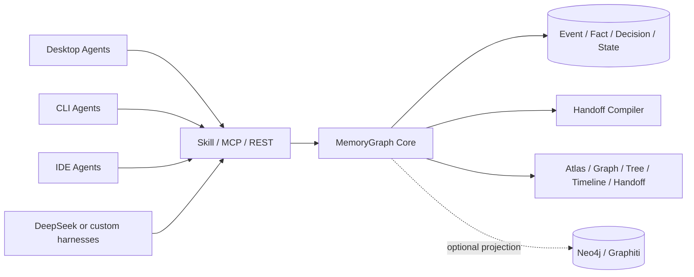

<p align="center">
  
</p>

<h1 align="center">MemoryGraph</h1>

<p align="center"><strong>One project state. Any agent. Continue anywhere.</strong><br>一份项目状态，任意 Agent，随处继续。</p>

<p align="center">
  
  
  
  
  
</p>

<p align="center"><a href="#中文">中文</a> · <a href="#english">English</a> · <a href="docs/PRODUCT_SPEC.md">Product Spec</a> · <a href="docs/SECURITY.md">Security</a></p>



---

## 中文

MemoryGraph 是一个本地优先的跨 Agent 项目状态层。它让接班 Agent 主动拉取上一个 Agent 的最新工作、核对真实仓库状态，并从中断位置继续，而不要求上一个 Agent 主动“交班”。

### 发布前隐私检查

仓库只包含源代码、文档、测试夹具和示例配置。`.env`、生成的 `.memorygraph/` 状态目录、数据库、日志和备份文件均不应提交；`NEO4J_PASSWORD`、`GRAPHITI_API_KEY` 等凭据只从进程环境或密钥管理器读取。发布前请同时检查工作树和 Git 历史，确认没有用户名、主目录路径、会话导出、私钥或真实凭据。

### 任意 Agent，而不是 Agent 白名单

MemoryGraph 不依赖某个模型厂商，也不区分桌面端、CLI、IDE 插件或自定义 harness。兼容性由协议能力决定：

| Agent / Harness 能力 | 接入方式 | 能做什么 |
|---|---|---|
| 支持 MCP stdio | 连接 MemoryGraph MCP | 完整使用 `resume_project`、`search`、`remember`、`trace` 等工具 |
| 支持 Agent Skills | 安装 `integrations/skills/memorygraph` | 用“继续”等自然语言自动选择正确 MCP 工具 |
| 不支持 MCP，但能发 HTTP | 调用本机 REST API | DeepSeek harness、脚本或自定义 Agent 可直接 resume/search/remember |
| 需要自动读取原生历史 | 增加 `AgentAdapter` | 从该工具自己的 session/log/database 增量导入原始事件 |

因此以下形态都能接入：

- 桌面端 Agent App
- CLI Agent
- IDE/编辑器 Agent
- DeepSeek、Qwen、GLM 等模型驱动的自定义 harness
- 自研脚本、编排器或多 Agent 系统

`codex`、`opencode`、`command-code`、`workbuddy`、`trae` 只是仓库已经内置的**一键配置/被动采集预设**，不是支持列表。

输出任意 harness 可使用的通用接入清单：

```bash
node dist/cli.js integration manifest
```

### 只安装 Skill 就够了吗？

不够。完整链路由三部分组成：

1. **MemoryGraph Skill**：理解“继续”“之前为什么这样决定”“某个 Agent 做了什么”等意图。
2. **MemoryGraph MCP**：提供 `resume_project`、`search`、`trace` 等真实工具。
3. **MemoryGraph Core**：同步各 Agent 的会话、保存事件/状态、验证 Git，并生成交接上下文。

至少需要满足：

- 接班 Agent 已安装 **Skill + MCP**。
- MemoryGraph Core 正在运行。
- 接班 Agent 打开的是同一个项目目录，或者明确传入相同的 `project_id`。

对于 Codex、OpenCode、Command Code 和 WorkBuddy，即使前一个 Agent 没有主动调用 `remember`，接班时也会通过被动适配器增量同步它的原生会话。仍然建议所有 Agent 都安装 Skill + MCP，这样显式决策和状态可以更准确地进入公共项目状态。

Trae 的原生 transcript 库是不透明/加密格式。MemoryGraph 不提取密钥；它的被动层记录 workspace 活动，完整上下文需要 Trae 在工作过程中调用已安装的 MCP + Skill 来记录和查询共享状态。

### “换一个 Agent，说一句继续”怎么使用？

推荐流程：

```text
Agent A（例如 Codex）
  └─ 在项目中完成或做到一半

打开同一项目的 Agent B（例如 OpenCode）
  └─ 调用 MemoryGraph Skill
  └─ 说：继续

MemoryGraph 自动执行：
  1. resolve_project
  2. sync previous agent sessions
  3. verify repository / Git state
  4. compile bounded handoff context
  5. record Agent A → Agent B handoff

Agent B 获得：
  - 当前项目目标和状态
  - 已完成与正在进行的工作
  - 决策、事实和未解决问题
  - 当前分支、HEAD、未提交文件
  - 下一步建议与原始证据
```

最可靠的表达方式是：

```text
$memorygraph 继续
```

不同 Agent 的 Skill 调用语法可能不同；如果该 Agent 支持隐式 Skill 触发，直接说“继续”也可以。只有复制 Skill、但没有连接 MCP 时，Agent 会知道应该做什么，却没有工具读取共享状态。

也可以绕过自然语言直接验证：

```bash
node dist/cli.js resume /path/to/project \
  --agent opencode \
  --token-budget 1500
```

或使用显式项目 ID：

```bash
node dist/cli.js resume \
  --project-id prj_xxx \
  --agent opencode
```

### 内置 Agent 预设与通用接入

查看状态并安装 Skill + MCP：

```bash
node dist/cli.js integration status --agent all
node dist/cli.js integration install --agent all
```

当前内置的一键预设：

- `codex`
- `opencode`
- `command-code`
- `workbuddy`
- `trae`

这些名称只代表 MemoryGraph 已经知道如何自动修改其配置和/或读取其原生会话。其它 Agent 不需要等待进入这个列表：直接使用 `integration manifest` 中的 MCP stdio 配置，或调用 REST API 即可。

通用 MCP 配置形状：

```json
{
  "mcpServers": {
    "memorygraph": {
      "command": "/absolute/path/to/node",
      "args": [
        "/absolute/path/to/memorygraph/dist/cli.js",
        "mcp",
        "--data-dir",
        "/absolute/path/to/memorygraph-data"
      ]
    }
  }
}
```

没有 MCP 的 DeepSeek/custom harness 可以直接调用：

```bash
curl -X POST http://127.0.0.1:4765/api/resume \
  -H 'Content-Type: application/json' \
  -d '{
    "cwd": "/path/to/project",
    "receiving_agent": "deepseek-harness",
    "token_budget": 1500
  }'
```

注意：任意 Agent 都能主动使用共享状态；但如果一个未知的闭源工具从未调用 MCP/REST，而你又希望 MemoryGraph 自动读取它过去的私有聊天数据库，就必须为该私有格式增加 Adapter。没有系统能在不知道格式和权限的情况下安全读取任意闭源 App 的内部会话。

预设安装器只管理名为 `memorygraph` 的条目；修改 JSON 配置前会生成时间戳备份，Skill 更新和卸载也保留可恢复副本。

卸载某个 Agent 的接入：

```bash
node dist/cli.js integration uninstall --agent opencode
```

### 启动 Core

作为当前终端进程运行：

```bash
node dist/cli.js serve
```

推荐安装为用户级后台服务：

```bash
node dist/cli.js service install
node dist/cli.js service status
```

诊断数据库、Agent 数据源、UI 和服务：

```bash
node dist/cli.js doctor
```

### 可视化图谱怎么使用？

Core 运行后，在浏览器打开：

[http://127.0.0.1:4765](http://127.0.0.1:4765)

也可以使用 Tauri 桌面端。构建后的 macOS App 位于：

```text
src-tauri/target/release/bundle/macos/MemoryGraph Atlas.app
```

五种视图：

1. **Atlas**
   - 默认的“项目小区”总览。
   - 每个 Project 是一栋楼，跨项目依赖显示为连线。
   - 点击项目节点进入该项目的 Graph。

2. **Graph**
   - 查看项目内 Task、Decision、Fact、Issue、Session、Commit、File、Agent 和 Handoff 的关系。
   - 点击节点会缩放到该节点，并在右侧 Inspector 显示状态和证据。
   - 大图按状态和更新时间返回优先切片；被裁剪节点仍可通过 Search 拉取邻域。

3. **Tree**
   - Project Narrative Tree，不是文件目录。
   - 主父子关系形成树，多父关系显示为 Reference Branch。

4. **Timeline**
   - 查看消息、命令、决策、状态变化和 Handoff 的时间顺序。
   - `Memory Diff` 显示两个时间点之间新增、改变和失效的状态。

5. **Handoff**
   - 查看 Codex → OpenCode 等跨 Agent 交接。
   - 展示继承事件数、上下文 token、接班 Agent 和后续是否真实继续工作。

其它操作：

- **Sync**：立即增量同步所有已注册项目和 Agent 数据源。
- **Search / `⌘K`**：搜索全量项目记忆；点击 Node 结果会打开它的关系邻域。
- **Agent Trail**：只高亮某个 Agent 参与的节点。
- **Inspector**：查看来源 Agent、事件、文件/Git 证据和有效时间。

可视化默认读取 SQLite，不要求 Neo4j 正在运行。Neo4j 和 Graphiti 是可重建的可选投影；即使它们停止，Atlas 和交接功能仍然工作。

### 快速开始

要求 Node.js 22.5 或更高版本。只有在使用 Neo4j 投影或构建桌面 App 时才需要 Docker/Rust。

```bash
npm install
npm run build
node dist/cli.js init /path/to/project --name "My Project"
node dist/cli.js service install
node dist/cli.js integration install --agent all
```

项目身份保存在：

```text
.memorygraph/project.json
```

同一 Project 可以附加多个仓库根：

```bash
node dist/cli.js root add /path/to/another/repo \
  --project-id prj_xxx
```

显式记录长期状态：

```bash
node dist/cli.js remember /path/to/project \
  --agent codex \
  --kind state \
  --title "Current database" \
  --content "SQLite with a Neo4j projection" \
  --key database \
  --value '"sqlite+neo4j"'
```

### MCP 工具

- `resume_project`：同步并编译接班上下文。
- `search`：搜索项目事件和图节点。
- `remember`：记录用户明确要求长期保留的事实/状态/决策/问题/任务。
- `project_state`：读取当前状态，不创建 Handoff。
- `trace`：查看某个 Agent 做过什么。
- `explain`：查找决策原因和来源证据。

MCP Resources 覆盖 Workspace、Project State、Decision、Issue、Timeline 和 Handoff。

### Neo4j 与 Graphiti

SQLite 永远是权威数据源。Neo4j 和 Graphiti 都可以从原始事件重新生成。

```bash
read -r -s -p "Neo4j password: " NEO4J_PASSWORD; echo
export NEO4J_PASSWORD
docker compose up -d neo4j
node dist/cli.js project-neo4j /path/to/project
```

设置 `GRAPHITI_URL` 可以连接 Graphiti MCP HTTP endpoint。MemoryGraph 使用项目 UUID 作为 `group_id`，传递事件发生时间，并在 `add_memory` 后验证 episode 确实可查询；仅返回“queued”不视为写入成功。

### 桌面端

```bash
npm run desktop:dev
npm run desktop:build -- --bundles app
```

桌面端连接本机 `127.0.0.1:4765` 的 Core。正常使用前先安装 Core 服务。

### 验证

```bash
npm run validate
npm run verify:stdio -- /path/to/project /path/to/data opencode
npm run verify:opencode-adapter -- /path/from/a/real/opencode/session /path/to/opencode.db
NEO4J_TEST=1 NEO4J_PASSWORD="$NEO4J_PASSWORD" \
  npx vitest run tests/neo4j.integration.test.ts
```

详细完成标准见 [PRODUCT_SPEC.md](docs/PRODUCT_SPEC.md)，证据分类见 [VALIDATION.md](docs/VALIDATION.md)，隐私边界见 [SECURITY.md](docs/SECURITY.md)。

### 致谢

MemoryGraph 是独立实现。协议、接口、布局和集成边界参考了以下公开项目与标准；感谢它们的维护者和贡献者：

- [Model Context Protocol](https://modelcontextprotocol.io/) 与 [官方 TypeScript SDK](https://github.com/modelcontextprotocol/typescript-sdk)：MCP 工具、资源和 stdio 互操作。
- [Graphology](https://graphology.github.io/) 与 [Sigma.js](https://www.sigmajs.org/)：图模型和 WebGL 图谱渲染。
- [d3-hierarchy](https://d3js.org/)：叙事树布局。
- [Neo4j](https://neo4j.com/)：可选图投影后端。
- [Graphiti](https://github.com/getzep/graphiti)：可选的时间/语义丰富化集成边界。
- [React](https://react.dev/)、[Vite](https://vite.dev/) 与 [Tauri](https://tauri.app/)：Web UI、构建和桌面容器。

本项目通过公开 API、文档和各项目的正常依赖方式进行集成，不代表与上述项目存在隶属、赞助或官方背书关系；许可证与商标归各自项目所有。

---

## English

MemoryGraph is a local-first shared project-state layer for coding agents. A receiving agent pulls the latest evidence-backed state, verifies it against the real repository, and continues without requiring the previous agent to create an explicit handoff.

### Release privacy checklist

The repository contains source code, documentation, fixtures, and placeholder configuration only. Do not commit `.env` files, generated `.memorygraph/` state, databases, logs, or backups. Keep `NEO4J_PASSWORD`, `GRAPHITI_API_KEY`, and other credentials in the process environment or a secret manager. Before publishing, inspect both the working tree and Git history for usernames, home-directory paths, session exports, private keys, and real credentials.

### Any agent, not an agent allowlist

MemoryGraph is model-vendor agnostic and does not care whether a client is a desktop app, CLI, IDE plugin, or custom harness. Compatibility is protocol-based:

| Agent / harness capability | Integration path | Result |
|---|---|---|
| MCP stdio | Connect the MemoryGraph MCP server | Full `resume_project`, `search`, `remember`, `trace`, and related tools |
| Agent Skills | Install `integrations/skills/memorygraph` | Natural-language intents such as “continue” route to the correct MCP tool |
| HTTP but no MCP | Call the local REST API | DeepSeek harnesses, scripts, and custom agents can resume/search/remember directly |
| Passive native-history import | Implement `AgentAdapter` | Incrementally ingest that tool’s private session/log/database format |

This covers:

- desktop agent apps;
- CLI agents;
- IDE/editor agents;
- custom harnesses driven by DeepSeek, Qwen, GLM, or other models;
- internal orchestrators and multi-agent systems.

`codex`, `opencode`, `command-code`, `workbuddy`, and `trae` are bundled **one-command configuration/passive-capture presets**, not the compatibility list.

Print a universal integration manifest for any harness:

```bash
node dist/cli.js integration manifest
```

### Is installing the Skill enough?

No. The complete path has three parts:

1. **MemoryGraph Skill** understands intents such as “continue”, decision explanations, and agent tracing.
2. **MemoryGraph MCP** exposes the real `resume_project`, `search`, and related tools.
3. **MemoryGraph Core** synchronizes agent sessions, stores state, verifies Git, and compiles handoff context.

At minimum:

- The receiving agent must have both the **Skill and MCP connection**.
- MemoryGraph Core must be running.
- The receiving agent must open the same project root or provide the same `project_id`.

Codex, OpenCode, Command Code, and WorkBuddy can be synchronized passively even when the previous agent forgot to call `remember`. Installing Skill + MCP everywhere is still recommended because explicit decisions and durable state become more accurate.

Trae’s native transcript store is opaque/encrypted. MemoryGraph does not extract keys. Passive capture records workspace activity; full context requires Trae to use the installed MCP + Skill to record and query shared state while it works.

### Continue in another agent

```text
Agent A works in the project
        ↓
Open the same project in Agent B
        ↓
Invoke MemoryGraph and say “continue”
        ↓
resolve project → sync Agent A → verify Git → compile context
        ↓
Agent B receives current state, evidence, and next steps
```

The most reliable prompt is:

```text
$memorygraph continue
```

Exact Skill syntax differs by agent. If implicit Skill invocation is supported, plain “continue” can work. Copying only the Skill without configuring MCP gives the agent instructions but no tool that can read shared state.

Direct CLI verification:

```bash
node dist/cli.js resume /path/to/project \
  --agent opencode \
  --token-budget 1500
```

Or use an explicit project ID:

```bash
node dist/cli.js resume \
  --project-id prj_xxx \
  --agent opencode
```

### Bundled presets and universal integration

Inspect and install Skill + MCP entries:

```bash
node dist/cli.js integration status --agent all
node dist/cli.js integration install --agent all
```

Bundled one-command presets:

- `codex`
- `opencode`
- `command-code`
- `workbuddy`
- `trae`

These names only mean that MemoryGraph already knows how to mutate that client’s config and/or passively read its native sessions. Every other agent can integrate immediately through the MCP manifest or REST API.

Generic MCP shape:

```json
{
  "mcpServers": {
    "memorygraph": {
      "command": "/absolute/path/to/node",
      "args": [
        "/absolute/path/to/memorygraph/dist/cli.js",
        "mcp",
        "--data-dir",
        "/absolute/path/to/memorygraph-data"
      ]
    }
  }
}
```

DeepSeek/custom harness without MCP:

```bash
curl -X POST http://127.0.0.1:4765/api/resume \
  -H 'Content-Type: application/json' \
  -d '{
    "cwd": "/path/to/project",
    "receiving_agent": "deepseek-harness",
    "token_budget": 1500
  }'
```

Any agent can actively use shared state. Passive import is different: if an unknown closed-source tool never called MCP/REST and you want MemoryGraph to read its historical private chat database automatically, an adapter for that private format is required. No system can safely infer every closed-source storage format and permission boundary.

The preset installer manages only the `memorygraph` entry. JSON configs are backed up before mutation, and replaced/removed Skill directories remain recoverable.

Remove one integration:

```bash
node dist/cli.js integration uninstall --agent opencode
```

### Start Core

Foreground process:

```bash
node dist/cli.js serve
```

Recommended user background service:

```bash
node dist/cli.js service install
node dist/cli.js service status
```

Run diagnostics:

```bash
node dist/cli.js doctor
```

### Using the visual graph

With Core running, open:

[http://127.0.0.1:4765](http://127.0.0.1:4765)

The built macOS app is located at:

```text
src-tauri/target/release/bundle/macos/MemoryGraph Atlas.app
```

Views:

1. **Atlas** — the project “neighborhood”; click a project to enter its graph.
2. **Graph** — Task, Decision, Fact, Issue, Session, Commit, File, Agent, and Handoff relationships. Select a node to zoom and inspect evidence.
3. **Tree** — a Project Narrative Tree with reference branches for multi-parent relations.
4. **Timeline** — temporal events and Memory Diff between two points in time.
5. **Handoff** — agent-to-agent transfers, inherited context size, token count, and observed outcomes.

Other controls:

- **Sync** performs incremental synchronization now.
- **Search / `⌘K`** searches the full project memory; selecting a Node result loads its neighborhood.
- **Agent Trail** highlights work associated with one agent.
- **Inspector** shows validity, source agent, event, file, and Git evidence.

Visualization uses SQLite by default. Neo4j and Graphiti are optional rebuildable projections, so Atlas and handoff continue to work while they are offline.

### Quick start

Node.js 22.5 or newer is required. Docker/Rust are only needed for Neo4j projection or desktop builds.

```bash
npm install
npm run build
node dist/cli.js init /path/to/project --name "My Project"
node dist/cli.js service install
node dist/cli.js integration install --agent all
```

Project identity is stored in:

```text
.memorygraph/project.json
```

Attach another repository root to the same project:

```bash
node dist/cli.js root add /path/to/another/repo \
  --project-id prj_xxx
```

Record explicit durable state:

```bash
node dist/cli.js remember /path/to/project \
  --agent codex \
  --kind state \
  --title "Current database" \
  --content "SQLite with a Neo4j projection" \
  --key database \
  --value '"sqlite+neo4j"'
```

### MCP tools

- `resume_project` — synchronize and compile handoff context.
- `search` — search project events and graph nodes.
- `remember` — preserve an explicitly requested durable fact/state/decision/issue/task.
- `project_state` — read current truth without creating a handoff.
- `trace` — inspect what an agent did.
- `explain` — retrieve decision rationale and evidence.

MCP Resources cover Workspace, Project State, Decisions, Issues, Timeline, and Handoffs.

### Neo4j and Graphiti

SQLite is always authoritative. Neo4j and Graphiti can be rebuilt from raw events.

```bash
read -r -s -p "Neo4j password: " NEO4J_PASSWORD; echo
export NEO4J_PASSWORD
docker compose up -d neo4j
node dist/cli.js project-neo4j /path/to/project
```

Set `GRAPHITI_URL` to a Graphiti MCP HTTP endpoint for semantic enrichment. MemoryGraph uses the project UUID as `group_id`, sends event occurrence time, and verifies that an episode is queryable after `add_memory`; a queued response alone is not treated as success.

### Desktop

```bash
npm run desktop:dev
npm run desktop:build -- --bundles app
```

The Tauri console connects to Core at `127.0.0.1:4765`. Install the Core service before normal desktop use.

### Validation

```bash
npm run validate
npm run verify:stdio -- /path/to/project /path/to/data opencode
npm run verify:opencode-adapter -- /path/from/a/real/opencode/session /path/to/opencode.db
NEO4J_TEST=1 NEO4J_PASSWORD="$NEO4J_PASSWORD" \
  npx vitest run tests/neo4j.integration.test.ts
```

See [PRODUCT_SPEC.md](docs/PRODUCT_SPEC.md) for completion gates, [VALIDATION.md](docs/VALIDATION.md) for evidence categories, and [SECURITY.md](docs/SECURITY.md) for privacy boundaries.

### Acknowledgments

MemoryGraph is an independent implementation. Its protocol, interfaces, layouts, and integration boundaries draw on the following public projects and standards; thank you to their maintainers and contributors:

- [Model Context Protocol](https://modelcontextprotocol.io/) and the [official TypeScript SDK](https://github.com/modelcontextprotocol/typescript-sdk) for MCP tools, resources, and stdio interoperability.
- [Graphology](https://graphology.github.io/) and [Sigma.js](https://www.sigmajs.org/) for the graph model and WebGL visualization.
- [d3-hierarchy](https://d3js.org/) for the narrative-tree layout.
- [Neo4j](https://neo4j.com/) for the optional graph projection backend.
- [Graphiti](https://github.com/getzep/graphiti) for the optional temporal/semantic enrichment integration boundary.
- [React](https://react.dev/), [Vite](https://vite.dev/), and [Tauri](https://tauri.app/) for the web UI, build tooling, and desktop shell.

MemoryGraph integrates through public APIs, documentation, and normal package dependencies. It is not affiliated with, sponsored by, or endorsed by the projects above; their licenses and trademarks remain with their respective owners.
